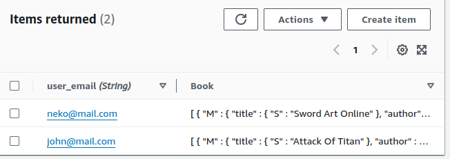

## Dyno Book
This is sample of code about DynamoDB structure.
In this case, i made an simple data that will contains lot of books that user have.
So, this relation would be similar one-to-many if in sql.

## Sample Data 

